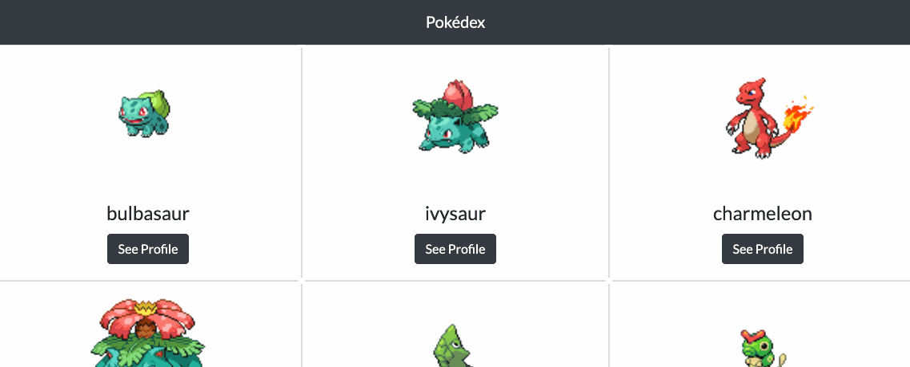

## Portfolio Website

This project is a web application that loads data from an external API and enables the viewing of data points in detail. In this case, I decided to write a small Pokédex app to display a list of Pokémon using the Pokémon API. The app uses a complex UI pattern, a modal from Bootstrap, for details or touch interactions.

The application loads Pokémon data from the API so users can view a list of Pokémons and click on the name of a Pokémon to view a modal with more details.

Please click [this link](https://molleira.github.io/simple-js-app/) to visit the Pokédex.

### About
The project has been created with **HTML**, **CSS** and **JavasCript**. It actually is my first learn-by-doing project development to learn the founditaions of this programming language.

The JavaScript file is a "showcase" of JavaScript basics, including simple and complex data types, loops, DOM traversing and DOM manipulation, and synchronous and asynchronous behaviour with *AJAX*, fetch and *JSON*.

For this project I also got the chance to learn *Bootstrap*, it's column system and responsive mobile-first approach, and its components with complex UI Patterns, like the modal used to display the information details.

### Development
In the future I intend to improve the program and make it more effective implementing newer functionality from *ES6*, *ES7* and *TypeScript*. I would also like to improve the UI to make it more attractive.

### Usage
Please let me know if you would like to use this project as a template to create your personal project. I'll be happy to get in touch and help with whatever you need.
